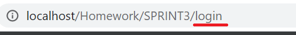
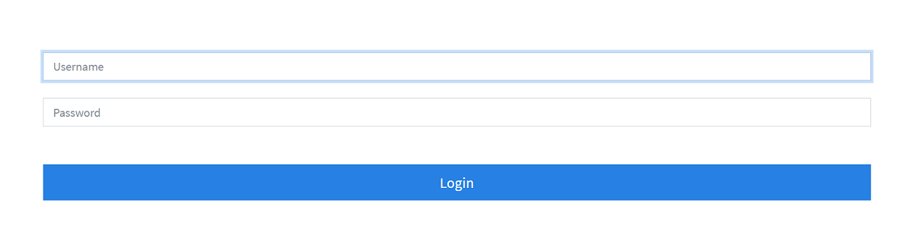
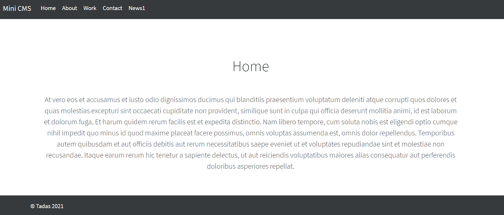
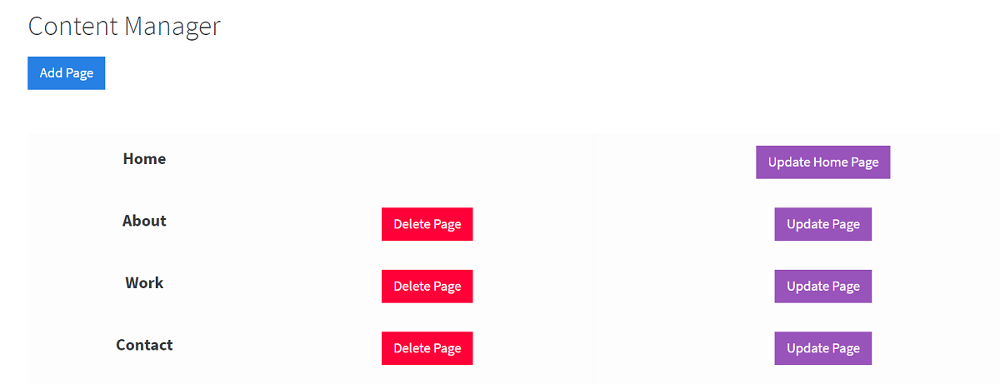
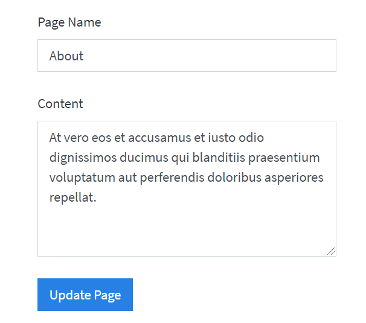

# Mini-CMS project

A content management system (CMS) is an application that is used to manage web content, allowing multiple contributors(administrators) to create, update and delete content.
___
<br>

## Features

 :heavy_check_mark: Admin's Login Page <br>
 :heavy_check_mark: Creating Content <br>
 :heavy_check_mark: Deleting Content <br>
 :heavy_check_mark: Updating Content <br> 
 :heavy_check_mark: ORM's <br> 
 :heavy_check_mark: Composer <br> 
 :heavy_check_mark: MySQL <br> 
 :heavy_check_mark: MD5 hashed passwords <br> 
 ___
<br>

## Instalation

- In order to run the project you need to have AMPPS and database managing application installed (MySQL Workbench preferred).
- When you have them just navigate to the main page of the repository and download or clone the project (.zip file).
- Add the project folder to your AMPPS projects directory ("../Ampps/www/"). 
- Import file ("../seeds/cms.sql") into MySQL Workbench in order to be able to use the existing database schema.
- Open the terminal in projects root directory and type "composer install" or "php composer.phar install" (it depends if you have it installed globally or not).
___
<br>

## Usage

- Open the directory via localhost.
- In order to login type **login** as basename <br>

</br>
- Use these usernames and passwords to login:

```bash
username: admin
password: admin
or
username: tadas
password: tadas
```
___
</br>

## Screenshots
<div>

<br>

<br>

<br>

</div>